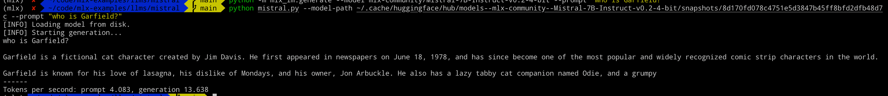

## How to run

## Date: 09/02/2024

### Setup

```
conda create -n mlx python=3.10
conda activate mlx
pip install mlx
pip install -r requirements.txt
huggingface-cli download mlx-community/Mistral-7B-Instruct-v0.2-4-bit
python mistral.py --model-path ~/.cache/huggingface/hub/models--mlx-community--Mistral-7B-Instruct-v0.2-4-bit/snapshots/8d170fd078c4751e5d3847b45ff8bfd2dfb48d7c --prompt "who is Garfield?"
```



### Conversion to mlx in both fp16 and q4

```
# torch-path == model path; mlx-path == output path
python convert.py --torch-path ../../../text-generation-webui/models/davzoku_cria-llama2-7b-v1.3 --mlx-path cria-llama2-7b-v1.3-mlx
```

this works; convert from a mlx model. note this ../lora/cria-v1.3-mlx model cannot be loaded.

```
# must be in llms folder
cd llms
python -m mlx_lm.convert --hf-path davzoku/cria-llama2-7b-v1.3 --mlx-path cria-llama2-7b-v1.3-q4-mlx -q --q-bits 4

python -m mlx_lm.convert --hf-path davzoku/cria-llama2-7b-v1.3 --mlx-path cria-llama2-7b-v1.3-mlx
```

#### Failed Conversions Notes

mainly due to redundant inv_freq

1. mlx_lm.convert without quantization
   [Throws a "received parameters not in model" error when trying to convert llama2:70b hf to 4 bit npz · Issue #305 · ml-explore/mlx-examples](https://github.com/ml-explore/mlx-examples/issues/305)

```
# mlx_lm.convert will succeed
python -m mlx_lm.convert --hf-path davzoku/cria-llama2-7b-v1.3 --mlx-path cria-llama2-7b-v1.3-mlx-7

# but mlx_lm.generate will have error
python -m mlx_lm.generate --model cria-llama2-7b-v1.3-mlx-7 --prompt "who are you?"
Traceback (most recent call last):
  File "/opt/homebrew/Caskroom/miniconda/base/envs/mlx/lib/python3.10/runpy.py", line 196, in _run_module_as_main
    return _run_code(code, main_globals, None,
  File "/opt/homebrew/Caskroom/miniconda/base/envs/mlx/lib/python3.10/runpy.py", line 86, in _run_code
    exec(code, run_globals)
  File "/opt/homebrew/Caskroom/miniconda/base/envs/mlx/lib/python3.10/site-packages/mlx_lm/generate.py", line 78, in <module>
    main(args)
  File "/opt/homebrew/Caskroom/miniconda/base/envs/mlx/lib/python3.10/site-packages/mlx_lm/generate.py", line 43, in main
    model, tokenizer = load(args.model)
  File "/opt/homebrew/Caskroom/miniconda/base/envs/mlx/lib/python3.10/site-packages/mlx_lm/utils.py", line 185, in load
    model.load_weights(list(weights.items()))
  File "/opt/homebrew/Caskroom/miniconda/base/envs/mlx/lib/python3.10/site-packages/mlx/nn/layers/base.py", line 148, in load_weights
    raise ValueError(f"Received parameters not in model: {extras}.")
ValueError: Received parameters not in model: model.layers.4.self_attn.rotary_emb.inv_freq model.layers.31.self_attn.rotary_emb.inv_freq model.layers.7.self_attn.rotary_emb.inv_freq model.layers.6.self_attn.rotary_emb.inv_freq model.layers.2.self_attn.rotary_emb.inv_freq model.layers.16.self_attn.rotary_emb.inv_freq model.layers.17.self_attn.rotary_emb.inv_freq model.layers.9.self_attn.rotary_emb.inv_freq model.layers.0.self_attn.rotary_emb.inv_freq model.layers.19.self_attn.rotary_emb.inv_freq model.layers.1.self_attn.rotary_emb.inv_freq model.layers.27.self_attn.rotary_emb.inv_freq model.layers.15.self_attn.rotary_emb.inv_freq model.layers.8.self_attn.rotary_emb.inv_freq model.layers.24.self_attn.rotary_emb.inv_freq model.layers.23.self_attn.rotary_emb.inv_freq model.layers.28.self_attn.rotary_emb.inv_freq model.layers.13.self_attn.rotary_emb.inv_freq model.layers.12.self_attn.rotary_emb.inv_freq model.layers.21.self_attn.rotary_emb.inv_freq model.layers.14.self_attn.rotary_emb.inv_freq model.layers.18.self_attn.rotary_emb.inv_freq model.layers.26.self_attn.rotary_emb.inv_freq model.layers.10.self_attn.rotary_emb.inv_freq model.layers.20.self_attn.rotary_emb.inv_freq model.layers.22.self_attn.rotary_emb.inv_freq model.layers.29.self_attn.rotary_emb.inv_freq model.layers.5.self_attn.rotary_emb.inv_freq model.layers.25.self_attn.rotary_emb.inv_freq model.layers.11.self_attn.rotary_emb.inv_freq model.layers.30.self_attn.rotary_emb.inv_freq model.layers.3.self_attn.rotary_emb.inv_freq.
```

2. mlx_lm.convert with quantization

weights, config = quantize_model(model, config, q_group_size, q_bits) will fail

```
python -m mlx_lm.convert --hf-path davzoku/cria-llama2-7b-v1.3 --mlx-path cria-llama2-7b-v1.3-q4-mlx -q --q-bits 4
/opt/homebrew/Caskroom/miniconda/base/envs/mlx/lib/python3.10/runpy.py:126: RuntimeWarning: 'mlx_lm.convert' found in sys.modules after import of package 'mlx_lm', but prior to execution of 'mlx_lm.convert'; this may result in unpredictable behaviour
  warn(RuntimeWarning(msg))
[INFO] Loading
Fetching 11 files: 100%|████████████████████████████████████████████████████████████| 11/11 [00:00<00:00, 178136.46it/s]
[INFO] Quantizing
Fetching 11 files: 100%|█████████████████████████████████████████████████████████████| 11/11 [00:00<00:00, 31006.28it/s]
Traceback (most recent call last):
  File "/opt/homebrew/Caskroom/miniconda/base/envs/mlx/lib/python3.10/runpy.py", line 196, in _run_module_as_main
    return _run_code(code, main_globals, None,
  File "/opt/homebrew/Caskroom/miniconda/base/envs/mlx/lib/python3.10/runpy.py", line 86, in _run_code
    exec(code, run_globals)
  File "/opt/homebrew/Caskroom/miniconda/base/envs/mlx/lib/python3.10/site-packages/mlx_lm/convert.py", line 209, in <module>
    convert(**vars(args))
  File "/opt/homebrew/Caskroom/miniconda/base/envs/mlx/lib/python3.10/site-packages/mlx_lm/convert.py", line 191, in convert
    weights, config = quantize_model(weights, config, hf_path, q_group_size, q_bits)
  File "/opt/homebrew/Caskroom/miniconda/base/envs/mlx/lib/python3.10/site-packages/mlx_lm/convert.py", line 94, in quantize_model
    model, _ = load(hf_path)
  File "/opt/homebrew/Caskroom/miniconda/base/envs/mlx/lib/python3.10/site-packages/mlx_lm/utils.py", line 185, in load
    model.load_weights(list(weights.items()))
  File "/opt/homebrew/Caskroom/miniconda/base/envs/mlx/lib/python3.10/site-packages/mlx/nn/layers/base.py", line 148, in load_weights
    raise ValueError(f"Received parameters not in model: {extras}.")
ValueError: Received parameters not in model: model.layers.0.self_attn.rotary_emb.inv_freq model.layers.2.self_attn.rotary_emb.inv_freq model.layers.26.self_attn.rotary_emb.inv_freq model.layers.19.self_attn.rotary_emb.inv_freq model.layers.27.self_attn.rotary_emb.inv_freq model.layers.17.self_attn.rotary_emb.inv_freq model.layers.31.self_attn.rotary_emb.inv_freq model.layers.14.self_attn.rotary_emb.inv_freq model.layers.29.self_attn.rotary_emb.inv_freq model.layers.1.self_attn.rotary_emb.inv_freq model.layers.22.self_attn.rotary_emb.inv_freq model.layers.7.self_attn.rotary_emb.inv_freq model.layers.15.self_attn.rotary_emb.inv_freq model.layers.10.self_attn.rotary_emb.inv_freq model.layers.4.self_attn.rotary_emb.inv_freq model.layers.8.self_attn.rotary_emb.inv_freq model.layers.5.self_attn.rotary_emb.inv_freq model.layers.30.self_attn.rotary_emb.inv_freq model.layers.12.self_attn.rotary_emb.inv_freq model.layers.9.self_attn.rotary_emb.inv_freq model.layers.11.self_attn.rotary_emb.inv_freq model.layers.13.self_attn.rotary_emb.inv_freq model.layers.28.self_attn.rotary_emb.inv_freq model.layers.16.self_attn.rotary_emb.inv_freq model.layers.20.self_attn.rotary_emb.inv_freq model.layers.23.self_attn.rotary_emb.inv_freq model.layers.3.self_attn.rotary_emb.inv_freq model.layers.18.self_attn.rotary_emb.inv_freq model.layers.25.self_attn.rotary_emb.inv_freq model.layers.21.self_attn.rotary_emb.inv_freq model.layers.6.self_attn.rotary_emb.inv_freq model.layers.24.self_attn.rotary_emb.inv_freq.
```
